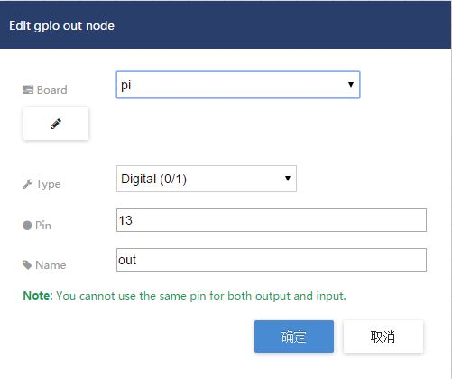

Arduino-Pi
----------

### 连接

首先将树莓派和arduino用USB线连接起来，在arduino上接一个开关和一个灯泡，分别作为输入和输出。开关和灯泡的SIG要接在arduino的软串口上，在这个例子中，灯泡的SIG接在D13，开关的SIG接在D12上。


### 树莓派

在树莓派上，需要安装(Node.js)[nodejs]和git。

首先使用git获取一份样例代码，并使用npm安装好需要的依赖项。

```shell
git clone https://github.com/Orientsoft/borgnix-examples
cd borgnix-example/arduino-pi
npm i
```

然后编辑*bindSerialPort.js*，主要更改MQTT broker的连接选项。

```javascript
var SerialPort = require('serialport').SerialPort
  , bindPhysical = require('../index').bindPhysical
  , mqtt = require('mqtt')
  , SERIAL_PORT = process.env.SERIAL_PORT || '/dev/ttyACM0'

  // create an mqtt client
  , options = { 'host': 'YOUR_MQTT_HOST'
              , 'port': 'YOUR_MQTT_PORT'
              , 'username': 'USERNAME'
              , 'password': 'PASSWORD'
              }
  , client = mqtt.connect(options)

client.on('connect', function() {
  console.log('mqtt connected')
})

client.on('error', function (err) {
  console.log(err)
})

// create a local serial port
var serialPort = new SerialPort(SERIAL_PORT,{
    baudrate: 57600,
    buffersize: 1
})

// bind the serial port to the mqtt client
bindPhysical({
  serialPort: serialPort,
  client: client,
  transmitTopic: 'serialClient',
  receiveTopic: 'physicalDevice'
})
```

然后运行*bindSerialPort.js*，将连接arduino的串口绑定在一个虚拟的MQTT串口上。

```shell
node bindSerialPort.js
```

成功运行之后，就可以在Node-RED中使用GPIO节点来对软串口进行读写了。

### Node-RED

如果你使用本地的Node-RED，由于GPIO是第三方的节点，需要先进行安装。

在Node-RED根目录下运行：

```shell
npm i node-red-contrib-gpio
```

重启Node-RED，就能使用GPIO节点了。

打开示例根目录下的*example-flow.txt*，复制里面所有的内容。在Node-RED 界面下，选择菜单-> import-> clipboard ，将复制的内容粘贴到弹出的对话框中，点击确定即可将一个样例flow导入。


接下来要对GPIO节点的配置进行一些修改。双击名为out的GPIO-OUT节点，将pin改为灯泡SIG所接的软串口。然后点击Board选项旁的编辑按钮，将MQTT Server选项改为之前绑定串口所用的MQTT broker。对于另一个GPIO-IN节点，操作是相似的。




最后点击Deploy按钮部署这个flow，等待GPIO节点正常连接，GPIO节点成功连接后会显示绿色的connected状态。如果一直没有连接成功，请检查MQTT broker的设置是否正确以及bindSerialPort.js是否正常运行。


如果以上步骤都顺利完成的话，在Node-RED中，点击inject节点，就可以控制灯泡的开关。按动arduino上的开关，可以在Node-RED的debug栏里看到相应的数据。

[nodejs]: https://nodejs.org/